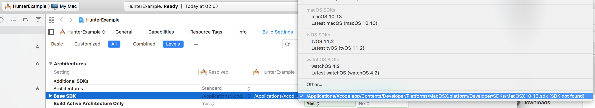
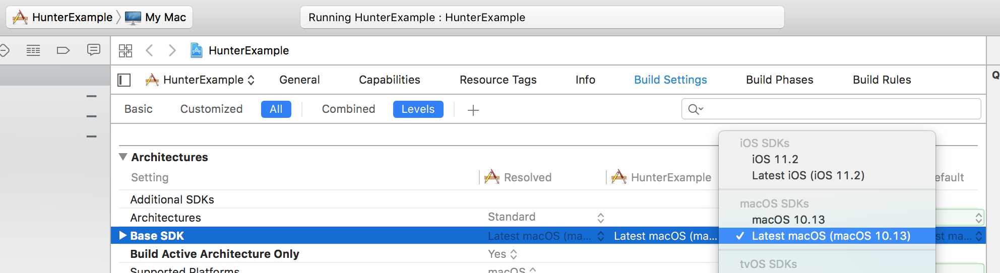

PS. I removed the `.hunter` directory before the `First Try`.

First try
----------

1. Testing without toolchain.
2. `CMAKE_OSX_SYSROOT` is set to `macosx` in
`CMakeLists.txt`.
3. Executes

    cmake -H. -Bbuild -GXcode

Result:
Failed to compile the hunter package. Error log is [here](Assets/ErrorLog1.txt)

Second try
----------

1. Testing without toolchain.
2. Comments out the `CMAKE_OSX_SYSROOT` line in `CMakeLists.txt`.
3. Executes

    cmake -H. -Bbuild -GXcode

Result:
Hunter builds succeeded. However, the generated Xcode project has wrong `BASE SDK` in `Build Settings`.

Workaround
----------

What I want is to use hunter to handle dependent libraries for my developing
app, and I use Xcode to build my actual app because it provides a friendly environment for debugging. Therefore, the expected behavior is:

1. Hunter builds dependent packages successfully.
2. The generated Xcode has correct `BASE SDK`.

To make (2) happen, the `CMAKE_OSX_SYSROOT` must set to `macosx`. So here's my
current workaround.

1. I did the `Second try`. Once hunter builds succeeded.
2. Uncomments the `CMAKE_OSX_SYSROOT` line again.
3. Executes

    cmake -H. -Bbuild -GXcode

Because hunter already built the packages in `Second Try`. It won't rebuild the
packages again. As a result, `cmake` now can generate the Xcode with `CMAKE_OSX_SYSROOT=macosx`, and the generated Xcode has valid `Base SDK`.

